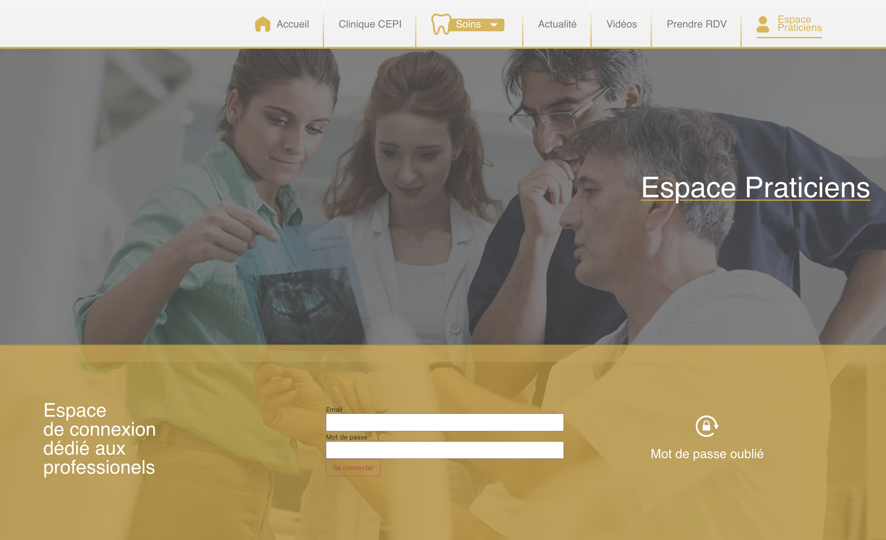
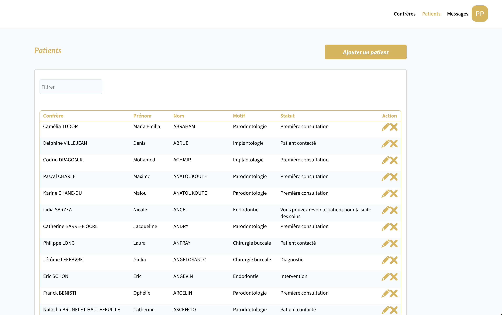
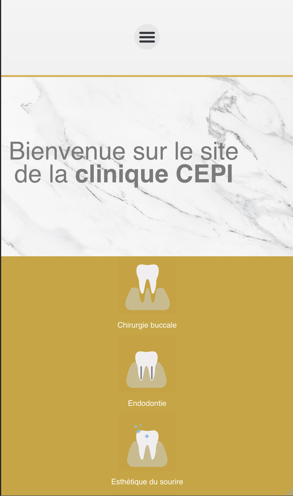

# Présentation d’un prototype

Le prototype a été réalisé sous Figma pour valider l’ergonomie sur desktop et mobile. Il a servi de base à la conception de l’interface utilisateur et à la validation des parcours principaux avec les parties prenantes.

## Choix ergonomiques
- **Navigation claire** : menu principal en haut, accès rapide aux sections clés (Accueil, Articles, Admin, Contact)
- **Contrastes respectés** : couleurs testées pour l’accessibilité (WCAG AA)
- **Responsive design** : chaque écran a été décliné en version mobile et desktop
- **Composants réutilisables** : boutons, formulaires, alertes, modales
- **Feedback utilisateur** : messages d’erreur et de succès visibles et accessibles

## Parcours utilisateurs principaux
- Connexion/inscription
- Création et gestion d’articles (Laravel et WordPress)
- Accès à l’espace admin (gestion des utilisateurs, rôles)
- Consultation du contenu public

## Sécurité et accessibilité
- Les écrans de connexion et d’administration intègrent des mesures de sécurité (masquage des mots de passe, validation côté client et serveur)
- Tous les formulaires sont accessibles au clavier et compatibles lecteurs d’écran

## Outils utilisés
- Figma pour la conception des maquettes
- Wave et axe DevTools pour l’audit accessibilité

## Exemples de captures d’écran

### Page de connexion

*Écran de connexion avec validation et message d’erreur accessible*

### Tableau de bord admin

*Vue d’ensemble de l’espace d’administration avec gestion des utilisateurs*

### Version mobile

*Accueil optimisé pour smartphone*

*Pour plus de détails, voir la maquette complète en annexe ou dans le dossier `docs/captures/`.*
